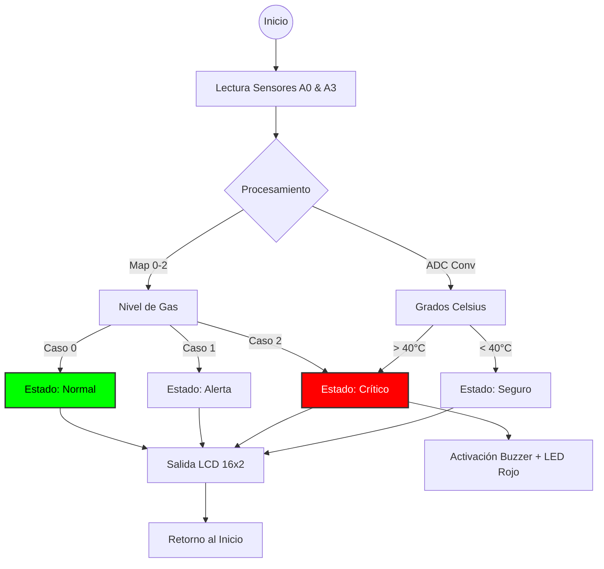

# 🛡️ SPMG: Sistema de Prevención de Monóxido y Gas

<p align="center">
  
  
  
  
</p>

---

## 📝 Descripción del Proyecto
El **Sistema de Prevención de Monóxido y Gas (SPMG)** es una solución de hardware embebido diseñada para detectar la "muerte silenciosa" por monóxido de carbono. El sistema realiza un monitoreo ambiental constante y activa protocolos de emergencia ante niveles críticos de gas o temperatura.

> **Nota de Transparencia:** Este repositorio conserva el código original de mi etapa de formación inicial. Se mantiene sin modificaciones para documentar mi progresión técnica y mis fundamentos en lógica de programación.

---

## 📺 Evidencia Técnica y Simulación

<p align="center">
  <a href="https://www.tinkercad.com/things/k7bioKIEf07-spmg">
    
  </a>
  &nbsp;&nbsp;
  <a href="https://youtu.be/eweGFmQ_UTY">
    
  </a>
</p>

---

## 📊 Arquitectura de Lógica (Mermaid)


---
## 🛠️ Especificaciones Técnicas

### 1. Hardware y Periféricos
| Componente | Función Técnica | Pin / Conexión |
| :--- | :--- | :--- |
| **Arduino UNO** | Microcontrolador central (ATmega328P) | Cerebro del sistema |
| **Sensor MQ (Gas)** | Detección analógica de partículas | Entrada Analógica A3 |
| **TMP36 (Temp)** | Medición de temperatura ambiente | Entrada Analógica A0 |
| **LCD 16x2** | Interfaz visual de usuario (HMI) | Pines 12, 11, 5, 4, 3, 2 |
| **Buzzer Activo** | Alerta auditiva de alta frecuencia | Pin Digital 13 |
| **LEDs (R/A/V)** | Indicadores visuales de estado (Semáforo) | Pines 6, 7, 8 |

### 2. Segmentación de Riesgos (Lógica de Control)
| Rango (Map) | Estado | Acción de Hardware | Mensaje LCD |
| :---: | :--- | :--- | :--- |
| **0** | **Normal** | LED Verde Encendido | "NORMAL" |
| **1** | **Intermedio** | LED Amarillo Encendido | "INTERMEDIO" |
| **2** | **Crítico** | LED Rojo + Buzzer (ON) | "CRITICO" |

---

## 🧪 Algoritmo Principal
Para la gestión de temperatura, el firmware implementa la siguiente conversión ADC a Celsius:

$$T = -40 + 0.488155 \times (LecturaADC - 20)$$

Para la normalización de las lecturas del sensor de gas, se aplica una función de mapeo lineal:
```cpp
int rango = map(sensor, 85, 382, 0, 3);
```
---

## 📈 Impacto Social e Innovación
A diferencia de los sensores industriales costosos, **SPMG** se posiciona como una alternativa de **bajo costo y código abierto**, permitiendo que comunidades en situaciones de vulnerabilidad energética puedan acceder a un sistema de alerta temprana. 

En regiones con climas extremos, donde el uso de calefacción a combustión es una necesidad vital, este proyecto demuestra que la ingeniería puede (y debe) ser una herramienta de prevención directa para salvar vidas.

---

> **"La ingeniería no solo resuelve problemas, protege lo que más importa."** ✨

